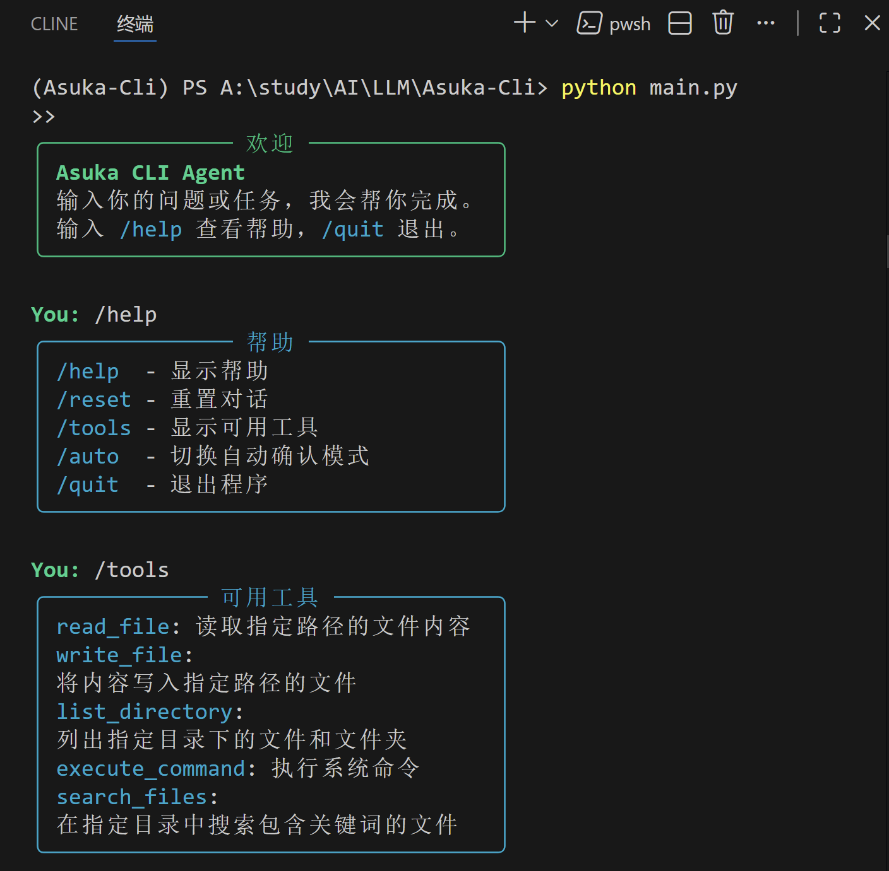
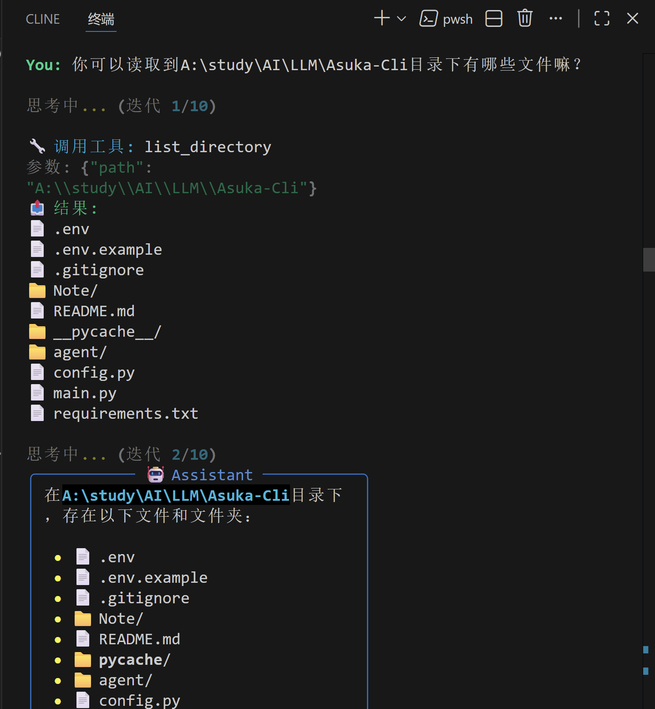
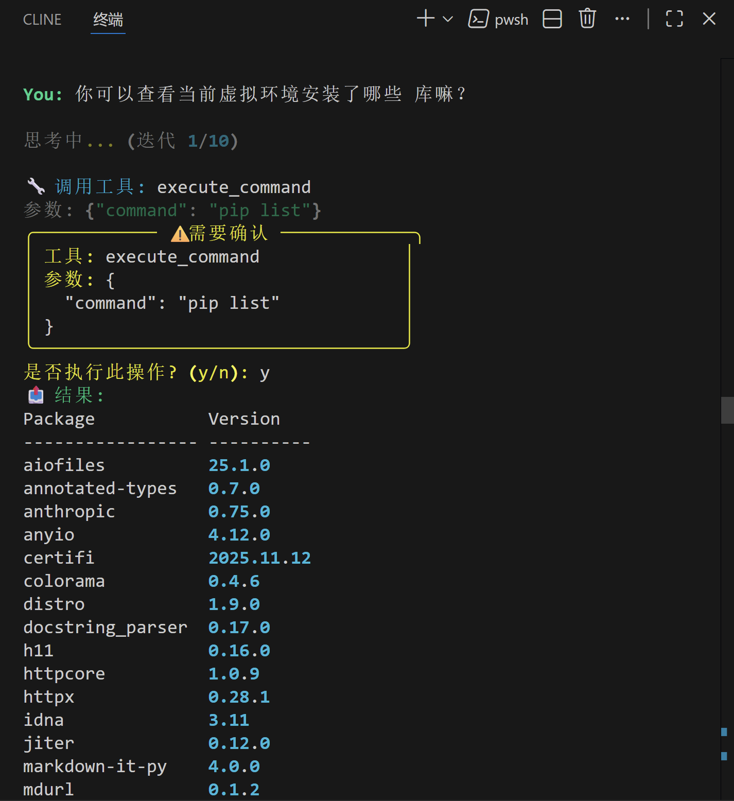
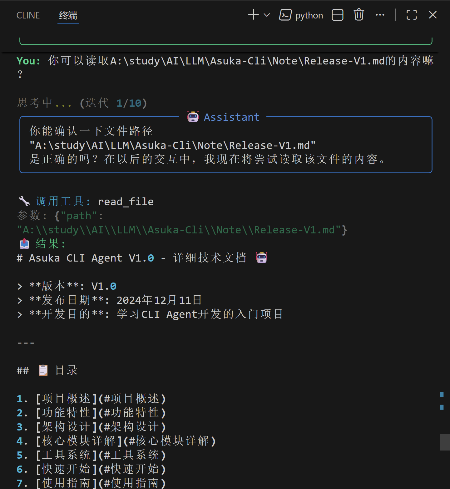
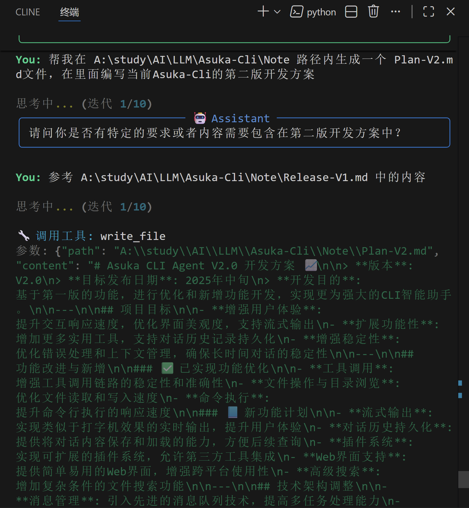
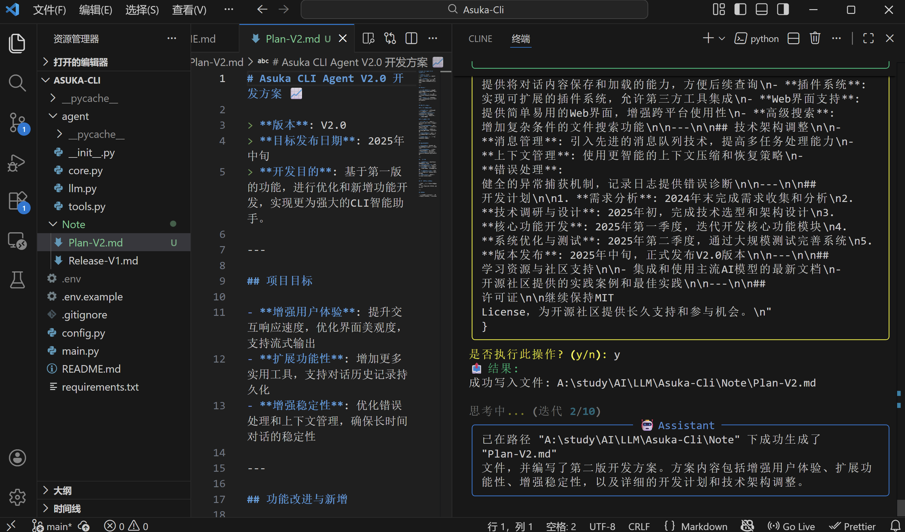

# Asuka CLI Agent V1.0 - 详细技术文档 🤖

> **版本**: V1.0  
> **发布日期**: 2024年12月11日  
> **开发目的**: 学习CLI Agent开发的入门项目

---

## 📋 目录

1. [项目概述](#项目概述)
2. [功能特性](#功能特性)
3. [架构设计](#架构设计)
4. [核心模块详解](#核心模块详解)
5. [工具系统](#工具系统)
6. [快速开始](#快速开始)
7. [使用指南](#使用指南)
8. [运行示例](#运行示例)
9. [依赖说明](#依赖说明)
10. [已知问题与改进方向](#已知问题与改进方向)
11. [学习资源](#学习资源)

---

## 项目概述

Asuka CLI Agent 是一个基于大语言模型（LLM）的命令行智能助手，旨在帮助开发者学习和理解 CLI Agent 的核心概念和实现方式。

### 设计目标

- **教学导向**: 代码结构清晰，注释完善，便于学习理解
- **最小可行**: 实现Agent核心功能，不过度设计
- **可扩展性**: 工具系统采用装饰器模式，易于扩展
- **多模型支持**: 统一封装OpenAI和Anthropic API

### 项目结构

```
Asuka-Cli/
├── main.py              # CLI入口，参数解析
├── config.py            # 配置管理，环境变量加载
├── requirements.txt     # Python依赖
├── .env.example         # 环境变量模板
├── .gitignore           # Git忽略规则
├── README.md            # 项目说明
├── agent/               # Agent核心模块
│   ├── __init__.py      # 模块导出
│   ├── core.py          # Agent主循环逻辑
│   ├── llm.py           # LLM API统一封装
│   └── tools.py         # 工具注册与执行系统
└── Note/
    └── Release-V1.md    # 本文档
```

---

## 功能特性

### ✅ 已实现功能

| 功能 | 描述 | 状态 |
|------|------|------|
| 🔧 工具调用 | LLM自动选择并调用工具完成任务 | ✅ |
| 📁 文件操作 | 读取、写入文件 | ✅ |
| 📂 目录浏览 | 列出目录内容 | ✅ |
| 💻 命令执行 | 执行系统Shell命令 | ✅ |
| 🔍 文件搜索 | 正则表达式搜索文件内容 | ✅ |
| 🔄 多轮对话 | 自动维护对话上下文 | ✅ |
| 🛡️ 安全确认 | 危险操作需用户确认 | ✅ |
| 🎨 美化输出 | Rich库美化终端显示 | ✅ |
| 🔌 多模型 | 支持OpenAI和Anthropic | ✅ |

### ⏳ 待实现功能

- [ ] 流式输出（Streaming）
- [ ] 对话历史持久化
- [ ] 更多内置工具
- [ ] 插件系统
- [ ] Web界面

---

## 架构设计

### Agent核心循环

```
┌─────────────────────────────────────────────────────────────┐
│                      Agent 主循环                           │
├─────────────────────────────────────────────────────────────┤
│                                                             │
│   用户输入                                                   │
│      ↓                                                      │
│   ┌─────────────┐                                           │
│   │  添加到消息  │                                           │
│   │   历史列表   │                                           │
│   └──────┬──────┘                                           │
│          ↓                                                  │
│   ┌─────────────┐     ┌─────────────┐                       │
│   │  调用 LLM   │────→│  返回响应   │                       │
│   │  (带工具)   │     │ (文本/工具) │                       │
│   └─────────────┘     └──────┬──────┘                       │
│                              ↓                              │
│                    ┌─────────────────┐                      │
│                    │  有工具调用？   │                      │
│                    └────────┬────────┘                      │
│                      是 ↓        ↓ 否                       │
│               ┌──────────────┐  ┌──────────────┐            │
│               │  执行工具    │  │  输出结果    │            │
│               │  收集结果    │  │  结束循环    │            │
│               └───────┬──────┘  └──────────────┘            │
│                       ↓                                     │
│               ┌──────────────┐                              │
│               │ 结果加入消息 │                              │
│               │ 继续循环     │──────→ 回到"调用LLM"         │
│               └──────────────┘                              │
│                                                             │
└─────────────────────────────────────────────────────────────┘
```

### 消息流转

```python
# 消息历史结构
messages = [
    Message(role="system", content="系统提示词..."),
    Message(role="user", content="用户输入"),
    Message(role="assistant", content="...", tool_calls=[...]),
    Message(role="tool", content="工具结果", tool_call_id="xxx"),
    Message(role="assistant", content="最终回复"),
]
```

---

## 核心模块详解

### 1. LLM客户端 (`agent/llm.py`)

统一封装OpenAI和Anthropic两种API，提供一致的调用接口。

#### 关键设计

```python
class LLMClient:
    """统一的LLM客户端"""
    
    def __init__(self, provider: Optional[str] = None):
        self.provider = provider or config.provider
        self._init_client()  # 根据provider初始化对应客户端
    
    def chat(self, messages, tools=None, stream=False) -> Dict:
        """统一的聊天接口"""
        if self.provider == "openai":
            return self._chat_openai(messages, tools, stream)
        else:
            return self._chat_anthropic(messages, tools, stream)
```

#### API差异处理

| 特性 | OpenAI | Anthropic |
|------|--------|-----------|
| System消息 | 放在messages中 | 单独的system参数 |
| 工具格式 | function类型 | 自定义input_schema |
| 工具结果 | role="tool" | tool_result类型 |

### 2. 工具系统 (`agent/tools.py`)

采用装饰器模式实现工具注册，自动生成符合OpenAI Function Calling规范的Schema。

#### 工具注册示例

```python
@registry.register(
    name="read_file",
    description="读取指定路径的文件内容",
    parameters={
        "type": "object",
        "properties": {
            "path": {
                "type": "string",
                "description": "要读取的文件路径"
            }
        },
        "required": ["path"]
    }
)
def read_file(path: str) -> str:
    with open(path, 'r', encoding='utf-8') as f:
        return f.read()
```

#### 工具Schema生成

```python
def get_tools_schema(self) -> List[Dict]:
    """生成OpenAI格式的工具定义"""
    return [{
        "type": "function",
        "function": {
            "name": tool.name,
            "description": tool.description,
            "parameters": tool.parameters
        }
    } for tool in self._tools.values()]
```

### 3. Agent核心 (`agent/core.py`)

实现Agent的主循环逻辑，包括：
- 消息管理
- LLM调用
- 工具执行
- 用户交互

#### 关键方法

```python
def chat(self, user_input: str) -> str:
    """处理用户输入的主方法"""
    self.messages.append(Message(role="user", content=user_input))
    
    iteration = 0
    while iteration < self.max_iterations:
        iteration += 1
        
        # 调用LLM
        response = self.llm.chat(
            messages=self.messages,
            tools=registry.get_tools_schema()
        )
        
        # 处理响应
        if not response.get("tool_calls"):
            return response["content"]  # 无工具调用，返回结果
        
        # 执行工具并继续循环
        tool_results = self._execute_tool_calls(response["tool_calls"])
        self.messages.extend(tool_results)
```

---

## 工具系统

### 内置工具列表

| 工具名 | 功能 | 参数 | 需确认 |
|--------|------|------|--------|
| `read_file` | 读取文件内容 | `path`: 文件路径 | ❌ |
| `write_file` | 写入文件内容 | `path`, `content` | ✅ |
| `list_directory` | 列出目录内容 | `path`: 目录路径 | ❌ |
| `execute_command` | 执行系统命令 | `command`: 命令字符串 | ✅ |
| `search_files` | 搜索文件内容 | `path`, `pattern`, `file_extension` | ❌ |

### 添加自定义工具

```python
from agent.tools import registry

@registry.register(
    name="get_weather",
    description="获取指定城市的天气信息",
    parameters={
        "type": "object",
        "properties": {
            "city": {
                "type": "string",
                "description": "城市名称"
            }
        },
        "required": ["city"]
    },
    requires_confirmation=False
)
def get_weather(city: str) -> str:
    # 实现天气查询逻辑
    return f"{city}的天气：晴，25°C"
```

---

## 快速开始

### 1. 环境准备

```bash
# 创建conda环境（推荐）
conda create -n asuka python=3.12
conda activate asuka

# 或使用venv
python -m venv venv
source venv/bin/activate  # Linux/Mac
venv\Scripts\activate     # Windows
```

### 2. 安装依赖

```bash
pip install -r requirements.txt
```

### 3. 配置API密钥

```bash
cp .env.example .env
```

编辑 `.env` 文件：

```env
# OpenAI配置（支持兼容API）
OPENAI_API_KEY=your_api_key_here
OPENAI_BASE_URL=https://api.openai.com/v1
OPENAI_MODEL=gpt-4o
```

### 4. 运行

```bash
python main.py
```

---

## 使用指南

### 命令行参数

```bash
python main.py [选项]

选项:
  -p, --provider {openai,anthropic}  指定LLM提供商
  -c, --command TEXT                 执行单个命令后退出
  --no-confirm                       禁用危险操作确认
  --max-iterations N                 最大迭代次数（默认10）
```

### 交互式命令

| 命令 | 说明 |
|------|------|
| `/help` | 显示帮助信息 |
| `/reset` | 重置对话历史 |
| `/tools` | 显示可用工具列表 |
| `/auto` | 切换自动确认模式 |
| `/quit` | 退出程序 |

---

## 运行示例截图















---

## 依赖说明

### 运行环境

- **Python版本**: 3.12.12
- **包管理**: Conda + pip
- **环境名称**: Asuka-Cli

### 核心依赖

| 包名 | 版本 | 用途 |
|------|------|------|
| openai | 2.9.0 | OpenAI API客户端 |
| anthropic | 0.75.0 | Anthropic API客户端 |
| rich | 14.2.0 | 终端美化输出 |
| python-dotenv | 1.2.1 | 环境变量管理 |
| aiofiles | 25.1.0 | 异步文件操作 |
| pydantic | 2.12.5 | 数据验证 |

### 完整Conda环境依赖

以下是通过 `conda list` 获取的完整环境依赖：

#### Python包 (pip安装)

| 包名 | 版本 | 说明 |
|------|------|------|
| aiofiles | 25.1.0 | 异步文件I/O |
| annotated-types | 0.7.0 | 类型注解扩展 |
| anthropic | 0.75.0 | Anthropic Claude API |
| anyio | 4.12.0 | 异步I/O库 |
| certifi | 2025.11.12 | SSL证书 |
| colorama | 0.4.6 | 终端颜色支持 |
| distro | 1.9.0 | 系统信息检测 |
| docstring-parser | 0.17.0 | 文档字符串解析 |
| h11 | 0.16.0 | HTTP/1.1协议实现 |
| httpcore | 1.0.9 | HTTP核心库 |
| httpx | 0.28.1 | HTTP客户端 |
| idna | 3.11 | 国际化域名 |
| jiter | 0.12.0 | JSON解析器 |
| markdown-it-py | 4.0.0 | Markdown解析 |
| mdurl | 0.1.2 | URL解析 |
| openai | 2.9.0 | OpenAI API |
| pydantic | 2.12.5 | 数据验证框架 |
| pydantic-core | 2.41.5 | Pydantic核心 |
| pygments | 2.19.2 | 语法高亮 |
| python-dotenv | 1.2.1 | 环境变量管理 |
| rich | 14.2.0 | 终端美化 |
| sniffio | 1.3.1 | 异步库检测 |
| tqdm | 4.67.1 | 进度条 |
| typing-extensions | 4.15.0 | 类型扩展 |
| typing-inspection | 0.4.2 | 类型检查 |

#### Conda基础包

| 包名 | 版本 | 来源 |
|------|------|------|
| python | 3.12.12 | conda-forge |
| pip | 25.3 | conda-forge |
| setuptools | 80.9.0 | conda-forge |
| wheel | 0.45.1 | conda-forge |
| openssl | 3.6.0 | conda-forge |
| ca-certificates | 2025.11.12 | conda-forge |
| bzip2 | 1.0.8 | conda-forge |
| libexpat | 2.7.3 | conda-forge |
| libffi | 3.5.2 | conda-forge |
| liblzma | 5.8.1 | conda-forge |
| libsqlite | 3.51.1 | conda-forge |
| libzlib | 1.3.1 | conda-forge |
| tk | 8.6.13 | conda-forge |
| tzdata | 2025b | conda-forge |
| ucrt | 10.0.26100.0 | conda-forge |
| vc | 14.3 | conda-forge |
| vc14_runtime | 14.44.35208 | conda-forge |
| vcomp14 | 14.44.35208 | conda-forge |

### 快速安装

```bash
conda create -n Asuka-Cli python=3.12
conda activate Asuka-Cli               
pip install -r requirements.txt
python main.py
```

---

## 已知问题与改进方向

### 已知问题

1. **流式输出未启用**: 当前版本不支持流式输出，响应需等待完整生成
2. **上下文长度限制**: 长对话可能超出模型上下文限制
3. **错误处理**: 部分边界情况的错误处理不够完善

### V2改进方向

- [ ] **流式输出**: 实现打字机效果的实时输出
- [ ] **对话持久化**: 保存和加载对话历史
- [ ] **上下文管理**: 智能截断或总结长对话
- [ ] **更多工具**: 网络请求、数据库操作等
- [ ] **插件系统**: 支持动态加载外部工具
- [ ] **配置文件**: 支持YAML/TOML配置
- [ ] **日志系统**: 完善的日志记录

---

## 学习资源

### 官方文档

- [OpenAI Function Calling](https://platform.openai.com/docs/guides/function-calling)
- [Anthropic Tool Use](https://docs.anthropic.com/claude/docs/tool-use)
- [Rich Library](https://rich.readthedocs.io/)

### 开源参考项目

- [Open Interpreter](https://github.com/OpenInterpreter/open-interpreter) - 功能完善的CLI Agent
- [Aider](https://github.com/paul-gauthier/aider) - AI编程助手
- [LangChain](https://github.com/langchain-ai/langchain) - LLM应用框架

### 推荐阅读

- [ReAct: Synergizing Reasoning and Acting](https://arxiv.org/abs/2210.03629) - Agent推理模式论文
- [Toolformer](https://arxiv.org/abs/2302.04761) - 工具使用论文

---

## 📖 学习指南

本节为希望深入理解该项目代码和原理的学习者提供系统化的学习路径。

### 学习前置要求

在开始学习本项目之前，建议具备以下基础知识：

| 领域 | 要求 | 推荐学习资源 |
|------|------|------------|
| Python基础 | 函数、类、装饰器、类型注解 | [Python官方教程](https://docs.python.org/zh-cn/3/tutorial/) |
| 异步编程 | async/await基本概念 | [Python异步编程](https://docs.python.org/zh-cn/3/library/asyncio.html) |
| HTTP基础 | 请求/响应、JSON | [MDN HTTP指南](https://developer.mozilla.org/zh-CN/docs/Web/HTTP) |
| LLM概念 | 大语言模型基本原理 | OpenAI官方文档 |

### 学习路径规划

建议按以下顺序学习，每个阶段完成后再进入下一阶段：

```
第一阶段：理解项目结构 (1-2小时)
    ↓
第二阶段：学习配置系统 (1小时)
    ↓
第三阶段：掌握LLM API封装 (2-3小时)
    ↓
第四阶段：理解工具系统 (2-3小时)
    ↓
第五阶段：深入Agent核心 (3-4小时)
    ↓
第六阶段：实践与扩展 (自主探索)
```

---

### 第一阶段：理解项目结构

**目标**: 了解项目整体架构和各文件职责

#### 1.1 项目文件概览

```
Asuka-Cli/
├── main.py              # 🚪 入口文件 - 从这里开始阅读
├── config.py            # ⚙️ 配置管理 - 环境变量和默认值
├── agent/               # 🤖 核心模块目录
│   ├── __init__.py      # 📦 模块导出
│   ├── core.py          # 🧠 Agent大脑 - 主循环逻辑
│   ├── llm.py           # 🔌 LLM接口 - API封装
│   └── tools.py         # 🔧 工具系统 - 能力扩展
└── requirements.txt     # 📋 依赖清单
```

#### 1.2 代码阅读顺序

**推荐阅读顺序**（由浅入深）：

1. **`main.py`** - 程序入口，理解如何启动Agent
2. **`config.py`** - 配置如何加载和管理
3. **`agent/__init__.py`** - 模块如何导出
4. **`agent/tools.py`** - 工具如何定义和注册
5. **`agent/llm.py`** - LLM API如何调用
6. **`agent/core.py`** - Agent如何运作

#### 1.3 学习任务

- [ ] 运行 `python main.py --help` 查看所有命令行参数
- [ ] 阅读 `main.py`，理解 argparse 参数解析
- [ ] 画出项目的模块依赖关系图

---

### 第二阶段：学习配置系统

**目标**: 理解Python配置管理的最佳实践

#### 2.1 关键文件：`config.py`

```python
# 核心知识点

# 1. python-dotenv 加载环境变量
from dotenv import load_dotenv
load_dotenv()  # 自动读取 .env 文件

# 2. dataclass 定义配置结构
@dataclass
class LLMConfig:
    provider: str = "openai"
    openai_api_key: Optional[str] = None
    # ...

# 3. os.getenv 获取环境变量
openai_api_key=os.getenv("OPENAI_API_KEY")
```

#### 2.2 学习要点

| 知识点 | 说明 | 重要程度 |
|--------|------|----------|
| `@dataclass` | Python数据类，自动生成__init__等方法 | ⭐⭐⭐ |
| `load_dotenv()` | 从.env文件加载环境变量 | ⭐⭐⭐ |
| `Optional[str]` | 类型注解，表示可以为None | ⭐⭐ |
| `os.getenv()` | 获取环境变量，支持默认值 | ⭐⭐⭐ |

#### 2.3 学习任务

- [ ] 阅读 `config.py` 全部代码（约50行）
- [ ] 理解 `@dataclass` 装饰器的作用
- [ ] 创建自己的 `.env` 文件并测试配置加载
- [ ] 尝试添加一个新的配置项

#### 2.4 练习题

```python
# 练习：添加一个配置项控制日志级别
# 提示：在 LLMConfig 中添加 log_level 字段
# 从环境变量 LOG_LEVEL 读取，默认值为 "INFO"
```

---

### 第三阶段：掌握LLM API封装

**目标**: 理解如何统一封装不同LLM提供商的API

#### 3.1 关键文件：`agent/llm.py`

这是本项目最核心的模块之一，实现了：
- OpenAI API调用
- Anthropic API调用
- 统一的调用接口
- 工具调用(Function Calling)支持

#### 3.2 核心类：Message

```python
@dataclass
class Message:
    """消息数据类 - 理解LLM对话的基本单位"""
    role: str      # system, user, assistant, tool
    content: str   # 消息内容
    tool_calls: Optional[List[Dict]] = None  # 工具调用请求
    tool_call_id: Optional[str] = None       # 工具结果关联ID
```

**消息角色说明**：
- `system`: 系统提示词，定义AI行为
- `user`: 用户输入
- `assistant`: AI回复
- `tool`: 工具执行结果

#### 3.3 核心类：LLMClient

```python
class LLMClient:
    """统一LLM客户端 - 策略模式的应用"""
    
    def __init__(self, provider: Optional[str] = None):
        self.provider = provider or config.provider
        self._init_client()  # 根据provider初始化不同客户端
    
    def chat(self, messages, tools=None, stream=False) -> Dict:
        """统一接口 - 屏蔽底层差异"""
        if self.provider == "openai":
            return self._chat_openai(messages, tools, stream)
        else:
            return self._chat_anthropic(messages, tools, stream)
```

#### 3.4 OpenAI API调用详解

```python
def _chat_openai(self, messages, tools, stream):
    # 1. 构建请求参数
    kwargs = {
        "model": config.openai_model,
        "messages": formatted_messages,
        "max_tokens": config.max_tokens,
    }
    
    # 2. 添加工具定义
    if tools:
        kwargs["tools"] = tools
        kwargs["tool_choice"] = "auto"  # 让模型自动选择
    
    # 3. 发送请求
    response = self._client.chat.completions.create(**kwargs)
    
    # 4. 解析响应
    result = {
        "content": response.choices[0].message.content,
        "tool_calls": None,  # 可能包含工具调用
    }
    
    # 5. 处理工具调用
    if response.choices[0].message.tool_calls:
        result["tool_calls"] = [...]  # 提取工具调用信息
    
    return result
```

#### 3.5 学习要点

| 概念 | 说明 | 文档链接 |
|------|------|----------|
| Function Calling | LLM调用外部函数的能力 | [OpenAI文档](https://platform.openai.com/docs/guides/function-calling) |
| Tool Use | Anthropic的工具使用 | [Anthropic文档](https://docs.anthropic.com/claude/docs/tool-use) |
| 策略模式 | 运行时切换算法的设计模式 | - |

#### 3.6 学习任务

- [ ] 阅读 `agent/llm.py` 全部代码（约200行）
- [ ] 理解 OpenAI 和 Anthropic API 的差异
- [ ] 使用 Python REPL 单独测试 LLMClient
- [ ] 理解 tool_calls 的数据结构

#### 3.7 动手实验

```python
# 实验：单独测试LLM调用
from agent.llm import LLMClient, Message

client = LLMClient("openai")
messages = [
    Message(role="system", content="你是一个helpful助手"),
    Message(role="user", content="你好，请介绍你自己")
]
response = client.chat(messages)
print(response)
```

---

### 第四阶段：理解工具系统

**目标**: 掌握装饰器模式实现的工具注册系统

#### 4.1 关键文件：`agent/tools.py`

工具系统是Agent能够"做事"的关键，它实现了：
- 工具注册机制（装饰器模式）
- 工具Schema生成（给LLM看的说明书）
- 工具执行机制

#### 4.2 核心类：Tool

```python
@dataclass
class Tool:
    """工具定义 - 描述一个可调用的能力"""
    name: str                    # 工具名称
    description: str             # 工具描述（LLM据此决定是否调用）
    parameters: Dict[str, Any]   # 参数Schema（JSON Schema格式）
    function: Callable           # 实际执行的函数
    requires_confirmation: bool  # 是否需要用户确认
```

#### 4.3 核心类：ToolRegistry

```python
class ToolRegistry:
    """工具注册表 - 管理所有可用工具"""
    
    def __init__(self):
        self._tools: Dict[str, Tool] = {}  # 存储所有注册的工具
    
    def register(self, name, description, parameters, requires_confirmation=False):
        """装饰器：注册工具"""
        def decorator(func):
            self._tools[name] = Tool(
                name=name,
                description=description,
                parameters=parameters,
                function=func,
                requires_confirmation=requires_confirmation
            )
            return func
        return decorator
    
    def get_tools_schema(self) -> List[Dict]:
        """生成OpenAI格式的工具定义"""
        # 这个输出会传给LLM，让它知道有哪些工具可用
        return [{
            "type": "function",
            "function": {
                "name": tool.name,
                "description": tool.description,
                "parameters": tool.parameters
            }
        } for tool in self._tools.values()]
    
    def execute(self, name, arguments) -> str:
        """执行指定工具"""
        tool = self._tools.get(name)
        return tool.function(**arguments)
```

#### 4.4 工具定义示例解析

```python
@registry.register(
    name="read_file",                        # 工具名称
    description="读取指定路径的文件内容",      # 描述，LLM据此判断何时使用
    parameters={                              # JSON Schema格式的参数定义
        "type": "object",
        "properties": {
            "path": {
                "type": "string",
                "description": "要读取的文件路径"
            }
        },
        "required": ["path"]                  # 必填参数
    }
)
def read_file(path: str) -> str:
    """实际执行读取的函数"""
    with open(path, 'r', encoding='utf-8') as f:
        return f.read()
```

#### 4.5 JSON Schema简介

JSON Schema用于描述参数的结构：

```python
# 示例：一个包含多个参数的工具
parameters = {
    "type": "object",
    "properties": {
        "path": {
            "type": "string",
            "description": "搜索目录"
        },
        "pattern": {
            "type": "string", 
            "description": "搜索模式"
        },
        "max_results": {
            "type": "integer",
            "description": "最大结果数",
            "default": 10
        }
    },
    "required": ["path", "pattern"]  # path和pattern必填
}
```

#### 4.6 学习任务

- [ ] 阅读 `agent/tools.py` 全部代码（约250行）
- [ ] 理解 Python 装饰器的工作原理
- [ ] 理解 JSON Schema 的基本语法
- [ ] 分析每个内置工具的实现

#### 4.7 动手实验

```python
# 实验1：查看所有已注册的工具
from agent.tools import registry
print(registry.get_tools_schema())

# 实验2：添加自定义工具
@registry.register(
    name="hello",
    description="打招呼",
    parameters={
        "type": "object",
        "properties": {
            "name": {"type": "string", "description": "名字"}
        },
        "required": ["name"]
    }
)
def hello(name: str) -> str:
    return f"你好，{name}！"

# 测试
print(registry.execute("hello", {"name": "世界"}))
```

---

### 第五阶段：深入Agent核心

**目标**: 完全理解Agent的主循环逻辑

#### 5.1 关键文件：`agent/core.py`

这是整个项目的"大脑"，实现了：
- Agent主循环（ReAct模式）
- 消息历史管理
- 工具调用执行
- 用户交互界面

#### 5.2 核心类：Agent

```python
class Agent:
    """CLI Agent核心类"""
    
    # 系统提示词 - 定义AI的行为
    SYSTEM_PROMPT = """你是一个强大的CLI助手..."""
    
    def __init__(self, provider=None, system_prompt=None, max_iterations=10):
        self.llm = LLMClient(provider)       # LLM客户端
        self.system_prompt = system_prompt    # 系统提示词
        self.max_iterations = max_iterations  # 防止无限循环
        self.messages: List[Message] = []     # 对话历史
        self.require_confirmation = True      # 安全确认开关
```

#### 5.3 核心方法：chat() - Agent主循环

```python
def chat(self, user_input: str) -> str:
    """这是Agent的核心！理解这个方法就理解了Agent"""
    
    # 1️⃣ 添加用户消息到历史
    self.messages.append(Message(role="user", content=user_input))
    
    # 2️⃣ 开始迭代循环
    iteration = 0
    while iteration < self.max_iterations:
        iteration += 1
        
        # 3️⃣ 调用LLM，传入消息历史和可用工具
        response = self.llm.chat(
            messages=self.messages,
            tools=registry.get_tools_schema()  # 告诉LLM有哪些工具可用
        )
        
        # 4️⃣ 获取LLM响应
        content = response.get("content", "")
        tool_calls = response.get("tool_calls")
        
        # 5️⃣ 保存助手消息
        self.messages.append(Message(
            role="assistant",
            content=content,
            tool_calls=tool_calls
        ))
        
        # 6️⃣ 判断：是否有工具调用？
        if not tool_calls:
            return content  # 没有工具调用，任务完成
        
        # 7️⃣ 执行工具调用
        tool_results = self._execute_tool_calls(tool_calls)
        
        # 8️⃣ 将工具结果加入消息历史
        self.messages.extend(tool_results)
        
        # 9️⃣ 继续循环，让LLM根据工具结果继续推理
    
    return "达到最大迭代次数"
```

#### 5.4 Agent循环可视化

```
用户: "读取config.py文件"
         │
         ▼
    ┌─────────────────┐
    │ messages.append │  添加用户消息
    │   (user msg)    │
    └────────┬────────┘
             │
    ┌────────▼────────┐
    │   LLM.chat()    │  调用LLM
    │  传入tools列表   │
    └────────┬────────┘
             │
             ▼
    LLM返回: "我来读取文件"
    + tool_calls: [{name:"read_file", args:{path:"config.py"}}]
             │
    ┌────────▼────────┐
    │ 检测到tool_calls │
    │   执行工具       │
    └────────┬────────┘
             │
    ┌────────▼────────┐
    │ read_file()执行  │  实际读取文件
    │ 返回文件内容     │
    └────────┬────────┘
             │
    ┌────────▼────────┐
    │ messages.append │  添加工具结果
    │   (tool msg)    │
    └────────┬────────┘
             │
    ┌────────▼────────┐
    │   LLM.chat()    │  再次调用LLM
    │  包含工具结果    │
    └────────┬────────┘
             │
             ▼
    LLM返回: "文件内容如下：..."
    + tool_calls: None  (没有更多工具调用)
             │
             ▼
    任务完成，返回最终回复
```

#### 5.5 工具执行详解

```python
def _execute_tool_calls(self, tool_calls: List[Dict]) -> List[Message]:
    """执行工具调用并返回结果消息"""
    results = []
    
    for tool_call in tool_calls:
        # 1. 解析工具名称和参数
        tool_name = tool_call["function"]["name"]
        arguments = json.loads(tool_call["function"]["arguments"])
        
        # 2. 安全确认（危险操作）
        if not self._confirm_action(tool_name, arguments):
            result = "用户取消了此操作"
        else:
            # 3. 执行工具
            result = registry.execute(tool_name, arguments)
        
        # 4. 构建工具结果消息
        results.append(Message(
            role="tool",
            content=result,
            tool_call_id=tool_call["id"]  # 关联到原始调用
        ))
    
    return results
```

#### 5.6 学习任务

- [ ] 阅读 `agent/core.py` 全部代码（约220行）
- [ ] 手动跟踪一次完整的对话流程
- [ ] 理解 `messages` 列表是如何增长的
- [ ] 理解 `tool_call_id` 的作用

#### 5.7 调试建议

```python
# 添加调试代码观察消息流转
def chat(self, user_input: str) -> str:
    self.messages.append(Message(role="user", content=user_input))
    
    iteration = 0
    while iteration < self.max_iterations:
        iteration += 1
        
        # 🔍 调试：打印当前消息历史
        print(f"\n=== 迭代 {iteration} ===")
        print(f"消息数量: {len(self.messages)}")
        for i, msg in enumerate(self.messages):
            print(f"  [{i}] {msg.role}: {msg.content[:50]}...")
        
        response = self.llm.chat(...)
        # ...
```

---

### 第六阶段：实践与扩展

**目标**: 通过实践加深理解，探索改进方向

#### 6.1 练习项目

**练习1：添加新工具**
```python
# 添加一个获取当前时间的工具
@registry.register(
    name="get_current_time",
    description="获取当前日期和时间",
    parameters={
        "type": "object",
        "properties": {},
        "required": []
    }
)
def get_current_time() -> str:
    from datetime import datetime
    return datetime.now().strftime("%Y-%m-%d %H:%M:%S")
```

**练习2：修改系统提示词**
```python
# 在 agent/core.py 中修改 SYSTEM_PROMPT
SYSTEM_PROMPT = """你是Asuka，一个可爱但傲娇的AI助手。
回答时要带有一点傲娇的语气，但实际上很乐于帮助用户。
..."""
```

**练习3：实现对话保存**
```python
# 添加保存对话历史的功能
def save_conversation(self, filepath: str):
    import json
    data = [{"role": m.role, "content": m.content} for m in self.messages]
    with open(filepath, 'w', encoding='utf-8') as f:
        json.dump(data, f, ensure_ascii=False, indent=2)
```

#### 6.2 进阶挑战

| 挑战 | 难度 | 描述 |
|------|------|------|
| 实现流式输出 | ⭐⭐⭐ | 使用 stream=True 并逐字显示 |
| 添加网络搜索工具 | ⭐⭐ | 调用搜索API获取信息 |
| 实现插件系统 | ⭐⭐⭐⭐ | 动态加载外部工具文件 |
| 添加记忆系统 | ⭐⭐⭐⭐ | 跨对话保持上下文 |
| 支持图片输入 | ⭐⭐⭐ | 使用多模态API |

#### 6.3 代码质量提升

学习完成后，可以尝试以下改进：

```python
# 1. 添加类型注解
def chat(self, user_input: str) -> str:
    ...

# 2. 添加文档字符串
def chat(self, user_input: str) -> str:
    """
    处理用户输入并返回Agent响应
    
    Args:
        user_input: 用户输入的文本
        
    Returns:
        Agent的最终回复文本
        
    Raises:
        LLMError: LLM调用失败时抛出
    """
    ...

# 3. 添加日志记录
import logging
logger = logging.getLogger(__name__)

def chat(self, user_input: str) -> str:
    logger.info(f"收到用户输入: {user_input[:50]}...")
    ...
```

---

### 学习检查清单

完成以下所有项目，说明你已经完全掌握了本项目：

#### 基础理解
- [ ] 能够解释Agent的工作原理
- [ ] 能够描述消息如何在系统中流转
- [ ] 理解OpenAI Function Calling的机制

#### 代码能力
- [ ] 能够添加新的工具
- [ ] 能够修改系统提示词
- [ ] 能够调试Agent运行过程

#### 进阶能力
- [ ] 能够解释为什么使用装饰器模式
- [ ] 能够比较OpenAI和Anthropic API的差异
- [ ] 能够设计新功能的实现方案

#### 最终挑战
- [ ] 独立实现一个新功能（如对话保存）
- [ ] 能够向他人解释整个系统的工作原理
- [ ] 能够基于此项目开发自己的Agent应用

---

## 许可证

MIT License

---
